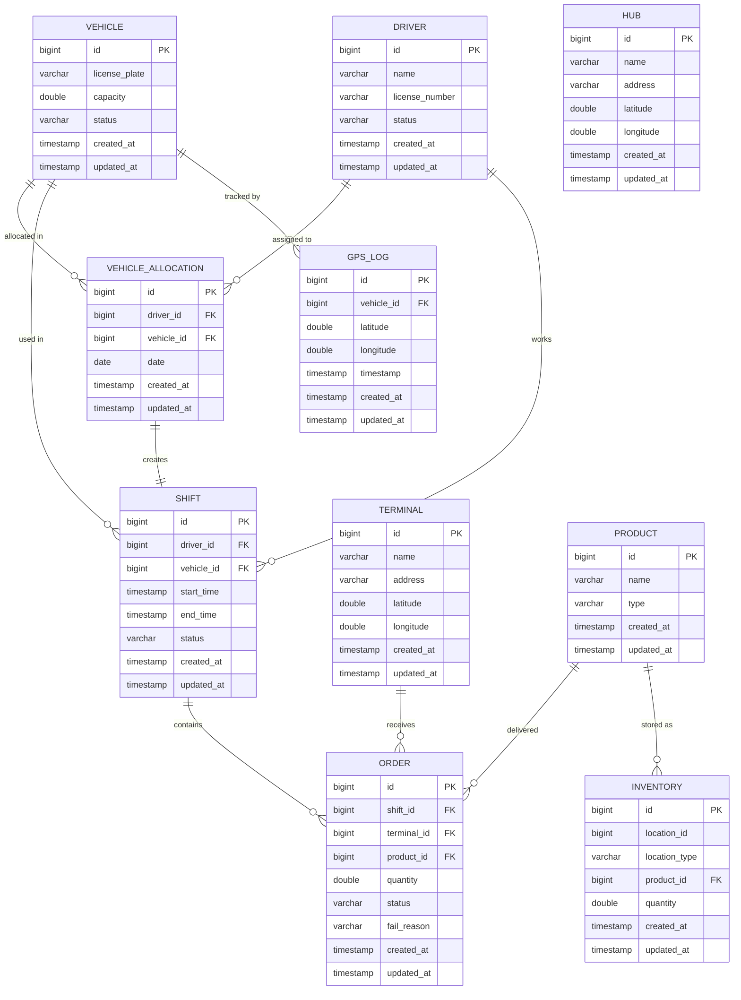
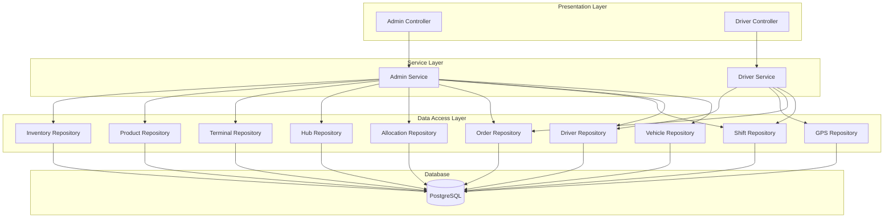

# Fleet Tracking Platform - Technical Presentation

## 📋 Table of Contents
1. [Problem Statement](#problem-statement)
2. [Requirements](#requirements)
3. [Core Entities](#core-entities)
4. [Database Design](#database-design)
5. [API Endpoints](#api-endpoints)
6. [Architecture Overview](#architecture-overview)
7. [Key Challenges](#key-challenges)
8. [Technology Stack](#technology-stack)

---

## 🎯 Problem Statement

Fleet management companies face significant challenges in efficiently tracking and managing their delivery operations:

- **Resource Allocation**: Difficulty in optimally allocating vehicles and drivers for daily operations
- **Real-time Tracking**: Lack of real-time visibility into fleet location and delivery status
- **Order Management**: Complex coordination between orders, drivers, vehicles, and delivery terminals
- **Inventory Tracking**: Need to track product inventory across multiple hubs and terminals
- **Operational Efficiency**: Manual processes leading to inefficiencies in shift management and delivery completion

### Business Impact
- Delayed deliveries affecting customer satisfaction
- Underutilized fleet resources
- Lack of accountability in delivery operations
- Difficulty in monitoring driver performance and vehicle utilization

---

## 📝 Requirements

### Functional Requirements

#### Admin Operations
1. **Master Data Management**
    - Create and manage Hubs (distribution centers)
    - Create and manage Terminals (delivery locations)
    - Create and manage Products
    - Create and manage Drivers
    - Create and manage Vehicles

2. **Resource Allocation**
    - Allocate vehicles to drivers for specific dates
    - Prevent double allocation of vehicles or drivers
    - Automatic shift creation upon allocation

3. **Order Management**
    - Create delivery orders assigned to shifts
    - Track order status (PENDING → IN_TRANSIT → COMPLETED/FAILED)
    - Associate orders with terminals and products

4. **Monitoring & Reporting**
    - View all active shifts
    - Monitor fleet status with real-time GPS data
    - Track inventory across locations
    - View all orders and their statuses

#### Driver Operations
1. **Shift Management**
    - Start assigned shifts
    - End active shifts
    - View active shift details

2. **Delivery Operations**
    - View assigned orders for current shift
    - Mark deliveries as completed
    - Mark deliveries as failed with reason

3. **Location Tracking**
    - Send GPS updates during active shifts
    - Real-time location tracking

### Non-Functional Requirements

1. **Concurrency Control**
    - Prevent race conditions in vehicle/driver allocation
    - Handle concurrent order updates safely
    - Transaction management for data consistency

2. **Scalability**
    - Support for multiple concurrent drivers
    - Efficient GPS data storage and retrieval
    - Optimized queries for fleet status

3. **Data Integrity**
    - Enforce unique constraints on allocations
    - Maintain referential integrity across entities
    - Audit trail with timestamps

4. **API Design**
    - RESTful API architecture
    - Clear separation between admin and driver endpoints
    - CORS support for frontend integration

---

## 🏗️ Core Entities

### 1. **Vehicle**
Represents fleet vehicles available for delivery operations.

**Attributes:**
- `id`: Unique identifier
- `licensePlate`: Vehicle registration number
- `capacity`: Load capacity (in tons/liters)
- `status`: AVAILABLE | MAINTENANCE | IN_USE
- `createdAt`, `updatedAt`: Audit timestamps

**Business Rules:**
- A vehicle can only be allocated to one driver per day
- Status changes based on allocation and shift state

---

### 2. **Driver**
Represents drivers who operate vehicles for deliveries.

**Attributes:**
- `id`: Unique identifier
- `name`: Driver's full name
- `licenseNumber`: Driving license number
- `status`: ACTIVE | INACTIVE
- `createdAt`, `updatedAt`: Audit timestamps

**Business Rules:**
- A driver can only be allocated one vehicle per day
- Must have ACTIVE status to start shifts

---

### 3. **VehicleAllocation**
Links drivers to vehicles for specific dates.

**Attributes:**
- `id`: Unique identifier
- `driver`: Reference to Driver entity
- `vehicle`: Reference to Vehicle entity
- `date`: Allocation date
- `createdAt`, `updatedAt`: Audit timestamps

**Constraints:**
- Unique constraint on (vehicle_id, date)
- Unique constraint on (driver_id, date)

**Business Rules:**
- Prevents double booking of vehicles
- Prevents double booking of drivers
- Automatically creates a SCHEDULED shift upon allocation

---

### 4. **Shift**
Represents a driver's work period with an assigned vehicle.

**Attributes:**
- `id`: Unique identifier
- `driver`: Reference to Driver entity
- `vehicle`: Reference to Vehicle entity
- `startTime`: Shift start timestamp
- `endTime`: Shift end timestamp
- `status`: SCHEDULED | ACTIVE | COMPLETED
- `createdAt`, `updatedAt`: Audit timestamps

**State Transitions:**
- SCHEDULED → ACTIVE (when driver starts shift)
- ACTIVE → COMPLETED (when driver ends shift)

**Business Rules:**
- Created automatically when vehicle allocation is made
- Driver can only have one ACTIVE shift at a time
- Orders are assigned to shifts, not directly to drivers

---

### 5. **Order**
Represents a delivery order for a specific product to a terminal.

**Attributes:**
- `id`: Unique identifier
- `shift`: Reference to Shift entity
- `terminal`: Reference to Terminal entity (delivery destination)
- `product`: Reference to Product entity
- `quantity`: Amount to deliver
- `status`: PENDING | IN_TRANSIT | COMPLETED | FAILED
- `failReason`: Reason for failure (if applicable)
- `createdAt`, `updatedAt`: Audit timestamps

**State Transitions:**
- PENDING → IN_TRANSIT (when shift becomes active)
- IN_TRANSIT → COMPLETED (successful delivery)
- IN_TRANSIT → FAILED (failed delivery with reason)

---

### 6. **Hub**
Represents distribution centers where products are stored.

**Attributes:**
- `id`: Unique identifier
- `name`: Hub name
- `address`: Physical address
- `latitude`, `longitude`: Geographic coordinates
- `createdAt`, `updatedAt`: Audit timestamps

**Purpose:**
- Central storage and distribution points
- Inventory management locations
- Starting points for delivery routes

---

### 7. **Terminal**
Represents delivery destinations (customer locations, retail outlets).

**Attributes:**
- `id`: Unique identifier
- `name`: Terminal name
- `address`: Physical address
- `latitude`, `longitude`: Geographic coordinates
- `createdAt`, `updatedAt`: Audit timestamps

**Purpose:**
- Delivery endpoints for orders
- Inventory receiving locations
- Route planning destinations

---

### 8. **Product**
Represents items being transported and delivered.

**Attributes:**
- `id`: Unique identifier
- `name`: Product name
- `type`: Product category/type
- `createdAt`, `updatedAt`: Audit timestamps

**Purpose:**
- Catalog of deliverable items
- Order line item reference
- Inventory tracking

---

### 9. **Inventory**
Tracks product quantities at different locations.

**Attributes:**
- `id`: Unique identifier
- `locationId`: Reference to Hub or Terminal
- `locationType`: HUB | TERMINAL
- `product`: Reference to Product entity
- `quantity`: Available quantity
- `createdAt`, `updatedAt`: Audit timestamps

**Business Rules:**
- Polymorphic location reference (can be Hub or Terminal)
- Updated when orders are completed
- Supports inventory visibility across the network

---

### 10. **GpsLog**
Stores real-time location data from vehicles.

**Attributes:**
- `id`: Unique identifier
- `vehicle`: Reference to Vehicle entity
- `latitude`, `longitude`: Geographic coordinates
- `timestamp`: Time of GPS reading
- `createdAt`, `updatedAt`: Audit timestamps

**Purpose:**
- Real-time fleet tracking
- Route history and analytics
- Delivery verification

---

## 🗄️ Database Design

### Technology
- **Database**: PostgreSQL 15
- **Migration Tool**: Liquibase
- **ORM**: Spring Data JPA with Hibernate

### Schema Overview



### Key Constraints

#### Unique Constraints
1. **VehicleAllocation**
    - `UNIQUE(vehicle_id, date)` - Prevents double allocation of vehicles
    - `UNIQUE(driver_id, date)` - Prevents double allocation of drivers

#### Foreign Key Relationships
- **VehicleAllocation** → Driver, Vehicle
- **Shift** → Driver, Vehicle
- **Order** → Shift, Terminal, Product
- **Inventory** → Product
- **GpsLog** → Vehicle

#### Indexes (Recommended)
- `vehicle_allocation(vehicle_id, date)` - Fast allocation lookups
- `vehicle_allocation(driver_id, date)` - Fast driver availability checks
- `shift(driver_id, status)` - Active shift queries
- `order(shift_id, status)` - Order filtering by shift
- `gps_log(vehicle_id, timestamp DESC)` - Latest location queries
- `inventory(location_id, location_type, product_id)` - Inventory lookups

### Migration Strategy
- **Liquibase Changesets**: Version-controlled schema changes
- **Rollback Support**: Each changeset can be reverted
- **Data Seeding**: Sample data for development and testing

---

## 🔌 API Endpoints

### Admin APIs
Base Path: `/api/admin`

#### Hub Management
| Method | Endpoint | Description | Request Body | Response |
|--------|----------|-------------|--------------|----------|
| POST | `/hubs` | Create a new hub | `HubDTO` | `Hub` |
| GET | `/hubs` | Get all hubs | - | `List<Hub>` |

**HubDTO:**
```json
{
  "name": "Central Hub",
  "address": "123 Main St",
  "latitude": 40.7128,
  "longitude": -74.0060
}
```

---

#### Terminal Management
| Method | Endpoint | Description | Request Body | Response |
|--------|----------|-------------|--------------|----------|
| POST | `/terminals` | Create a new terminal | `TerminalDTO` | `Terminal` |
| GET | `/terminals` | Get all terminals | - | `List<Terminal>` |

**TerminalDTO:**
```json
{
  "name": "Downtown Terminal",
  "address": "456 Oak Ave",
  "latitude": 40.7589,
  "longitude": -73.9851
}
```

---

#### Product Management
| Method | Endpoint | Description | Request Body | Response |
|--------|----------|-------------|--------------|----------|
| POST | `/products` | Create a new product | `ProductDTO` | `Product` |
| GET | `/products` | Get all products | - | `List<Product>` |

**ProductDTO:**
```json
{
  "name": "Diesel Fuel",
  "type": "FUEL"
}
```

---

#### Driver Management
| Method | Endpoint | Description | Request Body | Response |
|--------|----------|-------------|--------------|----------|
| POST | `/drivers` | Create a new driver | `DriverDTO` | `Driver` |
| GET | `/drivers` | Get all drivers | - | `List<Driver>` |

**DriverDTO:**
```json
{
  "name": "John Doe",
  "licenseNumber": "DL123456"
}
```

---

#### Vehicle Management
| Method | Endpoint | Description | Request Body | Response |
|--------|----------|-------------|--------------|----------|
| POST | `/vehicles` | Create a new vehicle | `VehicleDTO` | `Vehicle` |
| GET | `/vehicles` | Get all vehicles | - | `List<Vehicle>` |

**VehicleDTO:**
```json
{
  "licensePlate": "ABC-1234",
  "capacity": 5000.0
}
```

---

#### Vehicle Allocation
| Method | Endpoint | Description | Request Body | Response |
|--------|----------|-------------|--------------|----------|
| POST | `/allocations` | Allocate vehicle to driver | `VehicleAllocationDTO` | `VehicleAllocation` |
| GET | `/allocations` | Get all allocations | - | `List<VehicleAllocation>` |

**VehicleAllocationDTO:**
```json
{
  "driverId": 1,
  "vehicleId": 2,
  "date": "2025-12-28"
}
```

**Business Logic:**
- Validates vehicle is not already allocated for the date
- Validates driver is not already allocated for the date
- Creates a SCHEDULED shift automatically
- Throws exception if constraints violated

---

#### Order Management
| Method | Endpoint | Description | Request Body | Response |
|--------|----------|-------------|--------------|----------|
| POST | `/orders` | Create a new order | `OrderDTO` | `Order` |
| GET | `/orders` | Get all orders | - | `List<Order>` |

**OrderDTO:**
```json
{
  "shiftId": 1,
  "terminalId": 3,
  "productId": 2,
  "quantity": 1500.0
}
```

---

#### Monitoring & Reporting
| Method | Endpoint | Description | Response |
|--------|----------|-------------|----------|
| GET | `/shifts` | Get all shifts | `List<Shift>` |
| GET | `/fleet-status` | Get latest GPS location for all vehicles | `List<GpsLog>` |
| GET | `/inventory` | Get all inventory records | `List<Inventory>` |

---

### Driver APIs
Base Path: `/api/driver`

#### Shift Management
| Method | Endpoint | Description | Response |
|--------|----------|-------------|----------|
| POST | `/{driverId}/shift/start` | Start a shift | `Shift` |
| POST | `/shift/{shiftId}/end` | End a shift | `Shift` |
| GET | `/{driverId}/shift/active` | Get active shift | `Shift` |

**Business Logic:**
- Start shift: Changes status from SCHEDULED → ACTIVE, sets startTime
- End shift: Changes status from ACTIVE → COMPLETED, sets endTime
- Active shift: Returns current ACTIVE shift for driver

---

#### Order Management
| Method | Endpoint | Description | Response |
|--------|----------|-------------|----------|
| GET | `/shift/{shiftId}/orders` | Get all orders for shift | `List<Order>` |
| POST | `/orders/{orderId}/complete` | Mark order as completed | `Order` |
| POST | `/orders/{orderId}/fail?reason=...` | Mark order as failed | `Order` |

**Business Logic:**
- Complete: Changes status to COMPLETED
- Fail: Changes status to FAILED, stores failure reason

---

#### GPS Tracking
| Method | Endpoint | Description | Request Body | Response |
|--------|----------|-------------|--------------|----------|
| POST | `/gps` | Send GPS update | `GpsLogDTO` | `204 No Content` |

**GpsLogDTO:**
```json
{
  "vehicleId": 2,
  "latitude": 40.7489,
  "longitude": -73.9680,
  "timestamp": "2025-12-28T10:30:00"
}
```

---

## 🏛️ Architecture Overview

### Technology Stack
- **Backend Framework**: Spring Boot 3.2.0
- **Language**: Java 17
- **Database**: PostgreSQL 15
- **ORM**: Spring Data JPA (Hibernate)
- **Migration**: Liquibase
- **Message Queue**: Apache Kafka (for future event streaming)
- **Build Tool**: Maven
- **Containerization**: Docker & Docker Compose

### Layered Architecture



### Design Patterns

1. **Repository Pattern**
    - Spring Data JPA repositories for data access
    - Abstraction over database operations
    - Custom query methods for complex lookups

2. **Service Layer Pattern**
    - Business logic encapsulated in service classes
    - Transaction management at service level
    - Separation of concerns from controllers

3. **DTO Pattern**
    - Data Transfer Objects for API requests
    - Decoupling API contracts from entity models
    - Validation at DTO level

4. **Dependency Injection**
    - Constructor-based injection with Lombok's `@RequiredArgsConstructor`
    - Loose coupling between components
    - Testability through interface-based design

### Transaction Management
- `@Transactional` annotation on service methods
- ACID guarantees for critical operations
- Rollback on exceptions
- Isolation levels for concurrency control

---

## ⚠️ Key Challenges

### 1. Concurrency Control

#### Challenge: Double Allocation Prevention
**Problem:** Multiple admin users might try to allocate the same vehicle or driver simultaneously, leading to constraint violations or race conditions.

**Solution Implemented:**
```java
@Transactional
public VehicleAllocation allocateVehicle(VehicleAllocationDTO dto) {
    // Check if vehicle is already allocated for the day
    if (allocationRepository.findByVehicleIdAndDate(
            dto.getVehicleId(), dto.getDate()).isPresent()) {
        throw new RuntimeException("Vehicle already allocated");
    }
    
    // Check if driver is already allocated for the day
    if (allocationRepository.findByDriverIdAndDate(
            dto.getDriverId(), dto.getDate()).isPresent()) {
        throw new RuntimeException("Driver already allocated");
    }
    
    // Create allocation and shift
    // ...
}
```

**Mechanisms:**
- **Database Unique Constraints**: `UNIQUE(vehicle_id, date)` and `UNIQUE(driver_id, date)`
- **Transaction Isolation**: Spring's `@Transactional` ensures atomic operations
- **Optimistic Locking**: JPA's version field in `BaseEntity` (if implemented)
- **Pessimistic Locking**: Can use `@Lock(LockModeType.PESSIMISTIC_WRITE)` for high-contention scenarios

**Potential Improvements:**
- Implement distributed locking with Redis for multi-instance deployments
- Add retry logic with exponential backoff
- Use database-level advisory locks for critical sections

---

#### Challenge: Concurrent Order Status Updates
**Problem:** Driver completing an order while admin is modifying it, or multiple systems updating the same order.

**Solution Approach:**
- **Optimistic Locking**: Add `@Version` field to Order entity
- **State Machine Validation**: Only allow valid state transitions
- **Event Sourcing**: Consider event-driven architecture for audit trail

**Example with Optimistic Locking:**
```java
@Entity
public class Order extends BaseEntity {
    @Version
    private Long version;
    
    // Other fields...
}
```

---

### 2. GPS Data Volume

#### Challenge: High-Frequency GPS Updates
**Problem:** Drivers sending GPS updates every few seconds generates massive data volume.

**Current Implementation:**
- Simple insert into `gps_log` table
- Query for latest position per vehicle

**Scalability Concerns:**
- Table grows rapidly (millions of records per day)
- Query performance degrades over time
- Storage costs increase

**Recommended Solutions:**
1. **Time-Series Database**: Use TimescaleDB extension for PostgreSQL
2. **Data Partitioning**: Partition `gps_log` by date
3. **Data Retention**: Archive old GPS data to cold storage
4. **Aggregation**: Store only significant location changes
5. **Caching**: Cache latest position in Redis

**Example Partitioning:**
```sql
CREATE TABLE gps_log (
    -- columns
) PARTITION BY RANGE (timestamp);

CREATE TABLE gps_log_2025_12 PARTITION OF gps_log
    FOR VALUES FROM ('2025-12-01') TO ('2026-01-01');
```

---

### 3. Real-Time Fleet Status

#### Challenge: Efficient Latest Position Retrieval
**Problem:** Getting the latest GPS position for all vehicles requires complex queries.

**Current Implementation:**
```java
public List<GpsLog> getFleetStatus() {
    List<Vehicle> vehicles = vehicleRepository.findAll();
    return vehicles.stream()
        .map(vehicle -> gpsLogRepository
            .findTopByVehicleOrderByTimestampDesc(vehicle)
            .orElse(null))
        .filter(Objects::nonNull)
        .collect(Collectors.toList());
}
```

**Performance Issues:**
- N+1 query problem (one query per vehicle)
- Inefficient for large fleets

**Optimized Solutions:**
1. **Custom Query with Window Functions:**
```sql
SELECT DISTINCT ON (vehicle_id) *
FROM gps_log
ORDER BY vehicle_id, timestamp DESC;
```

2. **Materialized View:**
```sql
CREATE MATERIALIZED VIEW latest_vehicle_positions AS
SELECT DISTINCT ON (vehicle_id) *
FROM gps_log
ORDER BY vehicle_id, timestamp DESC;
```

3. **Redis Cache:**
    - Update Redis on each GPS update
    - Read from cache for fleet status
    - TTL for stale data cleanup

---

### 4. Shift and Order State Management

#### Challenge: Complex State Transitions
**Problem:** Ensuring valid state transitions and handling edge cases.

**State Machines:**

**Shift States:**
```
SCHEDULED → ACTIVE → COMPLETED
```

**Order States:**
```
PENDING → IN_TRANSIT → COMPLETED
                     → FAILED
```

**Edge Cases:**
- What if driver ends shift with incomplete orders?
- What if vehicle breaks down mid-shift?
- What if order is created for non-existent shift?

**Solutions:**
1. **Validation Rules:**
    - Only allow state transitions through specific methods
    - Validate preconditions before state change

2. **Event-Driven Architecture:**
    - Emit events on state changes
    - Other services react to events
    - Audit trail for debugging

3. **Saga Pattern:**
    - For distributed transactions
    - Compensating transactions for rollback

---

### 5. Inventory Management

#### Challenge: Polymorphic Location References
**Problem:** Inventory can be at Hubs or Terminals, requiring flexible querying.

**Current Design:**
```java
@Entity
public class Inventory extends BaseEntity {
    private Long locationId;
    private String locationType; // "HUB" or "TERMINAL"
    
    @ManyToOne
    private Product product;
    
    private Double quantity;
}
```

**Challenges:**
- No referential integrity for `locationId`
- Complex queries to join with actual location
- Type safety issues

**Alternative Approaches:**

1. **Separate Tables:**
```java
@Entity
public class HubInventory {
    @ManyToOne
    private Hub hub;
    // ...
}

@Entity
public class TerminalInventory {
    @ManyToOne
    private Terminal terminal;
    // ...
}
```

2. **Inheritance Mapping:**
```java
@Entity
@Inheritance(strategy = InheritanceType.JOINED)
public abstract class Inventory {
    @ManyToOne
    private Product product;
    private Double quantity;
}

@Entity
public class HubInventory extends Inventory {
    @ManyToOne
    private Hub hub;
}

@Entity
public class TerminalInventory extends Inventory {
    @ManyToOne
    private Terminal terminal;
}
```

---

### 6. Data Consistency Across Services

#### Challenge: Maintaining Consistency
**Problem:** When allocation creates a shift, both must succeed or fail together.

**Solution: Transactional Boundaries**
```java
@Transactional
public VehicleAllocation allocateVehicle(VehicleAllocationDTO dto) {
    // Save allocation
    VehicleAllocation allocation = allocationRepository.save(...);
    
    // Create shift (same transaction)
    Shift shift = new Shift();
    // ...
    shiftRepository.save(shift);
    
    return allocation;
    // Both committed together or rolled back on exception
}
```

**Distributed Scenario:**
If services are separated:
- Use **Saga Pattern** for distributed transactions
- Use **Event Sourcing** for eventual consistency
- Use **Two-Phase Commit** (not recommended for microservices)

---

### 7. API Versioning and Evolution

#### Challenge: Backward Compatibility
**Problem:** As the API evolves, existing clients must continue to work.

**Strategies:**
1. **URL Versioning**: `/api/v1/admin/orders`, `/api/v2/admin/orders`
2. **Header Versioning**: `Accept: application/vnd.fleetpanda.v1+json`
3. **Query Parameter**: `/api/admin/orders?version=1`

**Recommendation:**
- Use URL versioning for major changes
- Maintain at least one previous version
- Deprecation warnings in responses

---

### 8. Security Considerations

#### Current State
- CORS enabled for all origins (`@CrossOrigin(origins = "*")`)
- No authentication or authorization

#### Required Improvements
1. **Authentication:**
    - JWT tokens for API access
    - Separate tokens for admin vs driver roles

2. **Authorization:**
    - Role-based access control (RBAC)
    - Admin endpoints only for admin users
    - Driver endpoints scoped to specific driver

3. **API Security:**
    - Rate limiting to prevent abuse
    - Input validation and sanitization
    - SQL injection prevention (JPA handles this)

4. **Data Security:**
    - Encrypt sensitive data at rest
    - Use HTTPS for all communications
    - Audit logging for sensitive operations

---

## 🛠️ Technology Stack

### Backend
| Component | Technology | Version | Purpose |
|-----------|-----------|---------|---------|
| Framework | Spring Boot | 3.2.0 | Application framework |
| Language | Java | 17 | Programming language |
| Database | PostgreSQL | 15 | Relational database |
| ORM | Hibernate (JPA) | - | Object-relational mapping |
| Migration | Liquibase | - | Database version control |
| Message Queue | Apache Kafka | 7.3.0 | Event streaming (future) |
| Validation | Spring Validation | - | Input validation |

### Infrastructure
| Component | Technology | Purpose |
|-----------|-----------|---------|
| Containerization | Docker | Application packaging |
| Orchestration | Docker Compose | Local development |
| Database Container | postgres:15-alpine | PostgreSQL instance |
| Kafka Container | confluentinc/cp-kafka:7.3.0 | Message broker |
| Zookeeper | confluentinc/cp-zookeeper:7.3.0 | Kafka coordination |

### Development Tools
| Tool | Purpose |
|------|---------|
| Maven | Build and dependency management |
| Lombok | Boilerplate code reduction |
| Spring Boot DevTools | Hot reload during development |
| JUnit 5 | Unit testing |
| Mockito | Mocking framework for tests |

### Frontend (Separate)
- React-based admin dashboard
- Real-time updates via WebSocket (future)
- Map integration for GPS visualization

---

## 📊 System Metrics & Monitoring

### Key Performance Indicators (KPIs)

1. **Operational Metrics:**
    - Active shifts per day
    - Orders completed vs failed
    - Average delivery time
    - Vehicle utilization rate
    - Driver productivity

2. **Technical Metrics:**
    - API response time (p50, p95, p99)
    - Database query performance
    - GPS update frequency
    - Error rates by endpoint
    - Transaction rollback rate

3. **Business Metrics:**
    - Fleet efficiency
    - On-time delivery percentage
    - Resource allocation optimization
    - Inventory turnover

### Recommended Monitoring Tools
- **Application Monitoring**: Spring Boot Actuator + Prometheus
- **Database Monitoring**: pg_stat_statements, pgAdmin
- **Logging**: ELK Stack (Elasticsearch, Logstash, Kibana)
- **Tracing**: Zipkin or Jaeger for distributed tracing
- **Alerting**: Grafana for dashboards and alerts

---

## 🚀 Future Enhancements

### Short-term (1-3 months)
1. **Authentication & Authorization**
    - JWT-based authentication
    - Role-based access control
    - API key management

2. **Real-time Updates**
    - WebSocket integration for live fleet tracking
    - Push notifications for order status changes

3. **Advanced Querying**
    - Filtering and pagination for all list endpoints
    - Search functionality for drivers, vehicles, orders

4. **Reporting**
    - Daily/weekly/monthly reports
    - Export to PDF/Excel
    - Analytics dashboard

### Medium-term (3-6 months)
1. **Route Optimization**
    - AI-based route planning
    - Traffic integration
    - Multi-stop optimization

2. **Predictive Analytics**
    - Demand forecasting
    - Maintenance prediction
    - Driver performance analytics

3. **Mobile App**
    - Native iOS/Android driver app
    - Offline support
    - Push notifications

4. **Integration**
    - Third-party logistics providers
    - Payment gateways
    - Customer notification systems

### Long-term (6-12 months)
1. **Microservices Architecture**
    - Split into domain-specific services
    - Event-driven communication
    - Independent scaling

2. **Machine Learning**
    - Delivery time prediction
    - Anomaly detection
    - Customer behavior analysis

3. **IoT Integration**
    - Vehicle telematics
    - Fuel monitoring
    - Temperature tracking for perishables

4. **Multi-tenancy**
    - Support multiple fleet operators
    - Tenant isolation
    - Custom branding

---

## 📚 Conclusion

The Fleet Tracking Platform provides a robust foundation for managing fleet operations with:

✅ **Comprehensive entity model** covering all aspects of fleet management  
✅ **Well-designed database schema** with proper constraints and relationships  
✅ **RESTful API** with clear separation of admin and driver operations  
✅ **Concurrency handling** through transactions and unique constraints  
✅ **Scalable architecture** ready for future enhancements  
✅ **Real-time tracking** capabilities with GPS logging

### Key Strengths
- Strong data integrity through database constraints
- Transaction management for critical operations
- Flexible inventory management across locations
- Comprehensive order lifecycle tracking
- Real-time fleet visibility

### Areas for Improvement
- Implement authentication and authorization
- Optimize GPS data storage and retrieval
- Add comprehensive error handling
- Implement API versioning
- Enhance monitoring and observability
- Add comprehensive test coverage

---

## 📞 Contact & Resources

**Documentation:**
- [README.md](../README.md) - Setup and quick start guide
- API Documentation: Available at `/swagger-ui.html` (when Swagger is integrated)

**Repository Structure:**
```
fleet-tracking-platform/
├── src/main/java/com/fleetpanda/tracking/
│   ├── controller/     # REST API endpoints
│   ├── service/        # Business logic
│   ├── repository/     # Data access layer
│   ├── entity/         # JPA entities
│   └── dto/            # Data transfer objects
├── src/main/resources/
│   └── db/changelog/   # Liquibase migrations
├── src/test/           # Unit and integration tests
├── frontend/           # React admin dashboard
└── docker-compose.yml  # Infrastructure setup
```

**Development Team:**
- Backend: Spring Boot, PostgreSQL, Kafka
- Frontend: React, Material-UI
- DevOps: Docker, CI/CD

---

*This presentation document is maintained as part of the Fleet Tracking Platform project. Last updated: December 28, 2025*
