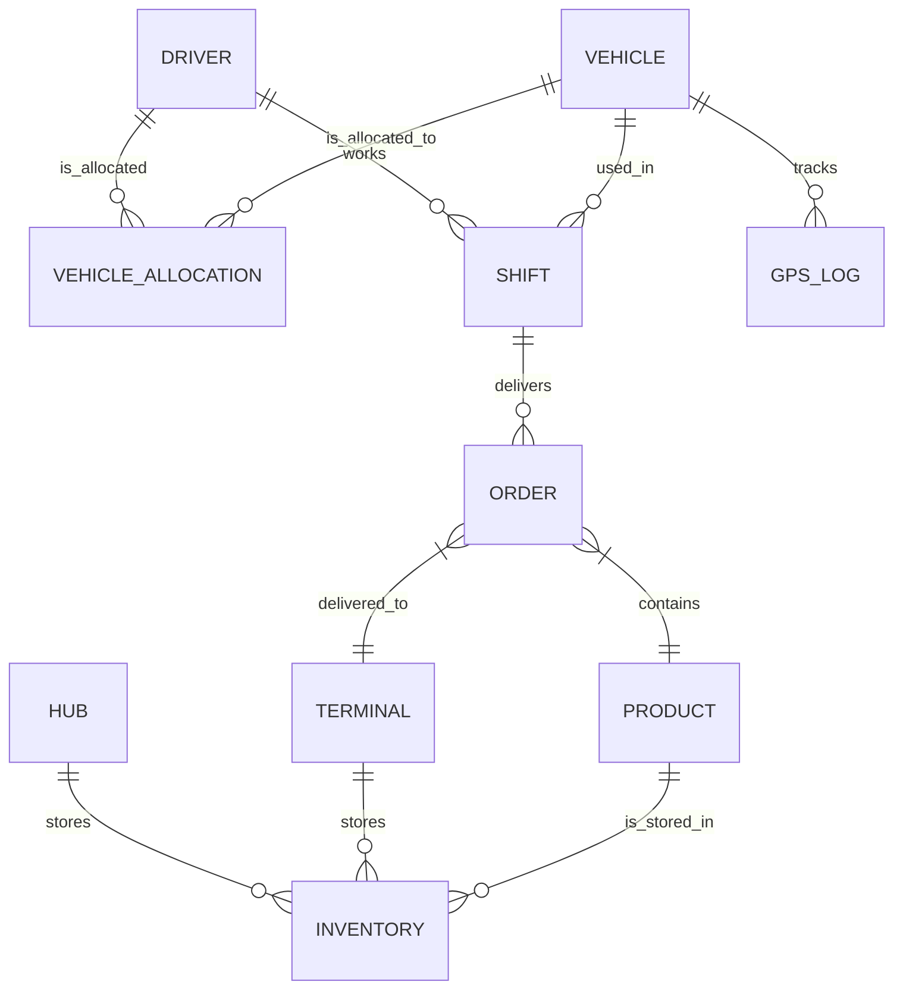

# Database Design

## ER Diagram

## Tables

### Locations
- **Hub**: `id`, `name`, `address`, `latitude`, `longitude`
- **Terminal**: `id`, `name`, `address`, `latitude`, `longitude`

### Resources
- **Product**: `id`, `name`, `type` (DIESEL, PETROL, etc.)
- **Driver**: `id`, `name`, `license_number`, `status`
- **Vehicle**: `id`, `license_plate`, `capacity`, `status`

### Operations
- **Inventory**: `id`, `location_id`, `location_type` (HUB/TERMINAL), `product_id`, `quantity`
- **VehicleAllocation**: `id`, `driver_id`, `vehicle_id`, `date`
    - *Constraint*: Unique (vehicle_id, date)
    - *Constraint*: Unique (driver_id, date)
- **Shift**: `id`, `driver_id`, `vehicle_id`, `start_time`, `end_time`, `status` (ACTIVE, COMPLETED)
- **Order**: `id`, `shift_id`, `terminal_id`, `product_id`, `quantity`, `status` (PENDING, IN_TRANSIT, COMPLETED, FAILED), `fail_reason`
- **GpsLog**: `id`, `vehicle_id`, `latitude`, `longitude`, `timestamp`
